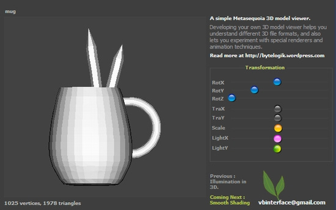



## Simple 3D Metasequoia Model Viewer

### Description

This is a 3D model viewer for Metasequoia models having basic rendering functionality. Metasequoia is a simple yet very powerful 3D modeler with lots of 3D modelling tools. The application helps you to understand parsing 3D object files which are in ASCII format. Also you will learn how to implement 3D transformation, flat shading, etc.

One of the new feature added is, use of beautiful images to create very impressive looking slider buttons for horizontal scroll bars. I am sure you will certainly love it.

Much of my attention while developing application is always on keeping the code small and compact as well as designing distinctively good looking user interfaces. Such an approach always ends with complex logics, but I enjoy it.

My previous posts did not yield good votes/comments. I do not know why. If some-one can let me know the reason behind this, please comment. Although I don't care about votes, I do appreciate comments because it is just like an feedback to me. And votes will let me know if I have worked well on my applications.

I hope you will like my 2D/3D graphics related submissions.

Happy coding :)
 
### More Info
 

             |
---                |---
**Submitted On**   |2010-03-23 12:10:00
**By**             |[vbinterface](https://github.com/Planet-Source-Code/PSCIndex/blob/master/ByAuthor/vbinterface.md)
**Level**          |Intermediate
**User Rating**    |5.0 (10 globes from 2 users)
**Compatibility**  |VB 6\.0
**Category**       |[Graphics](https://github.com/Planet-Source-Code/PSCIndex/blob/master/ByCategory/graphics__1-46.md)
**World**          |[Visual Basic](https://github.com/Planet-Source-Code/PSCIndex/blob/master/ByWorld/visual-basic.md)
**Archive File**   |[Simple\_3D\_2181225162010\.zip](https://github.com/Planet-Source-Code/vbinterface-simple-3d-metasequoia-model-viewer__1-73159/archive/master.zip)

